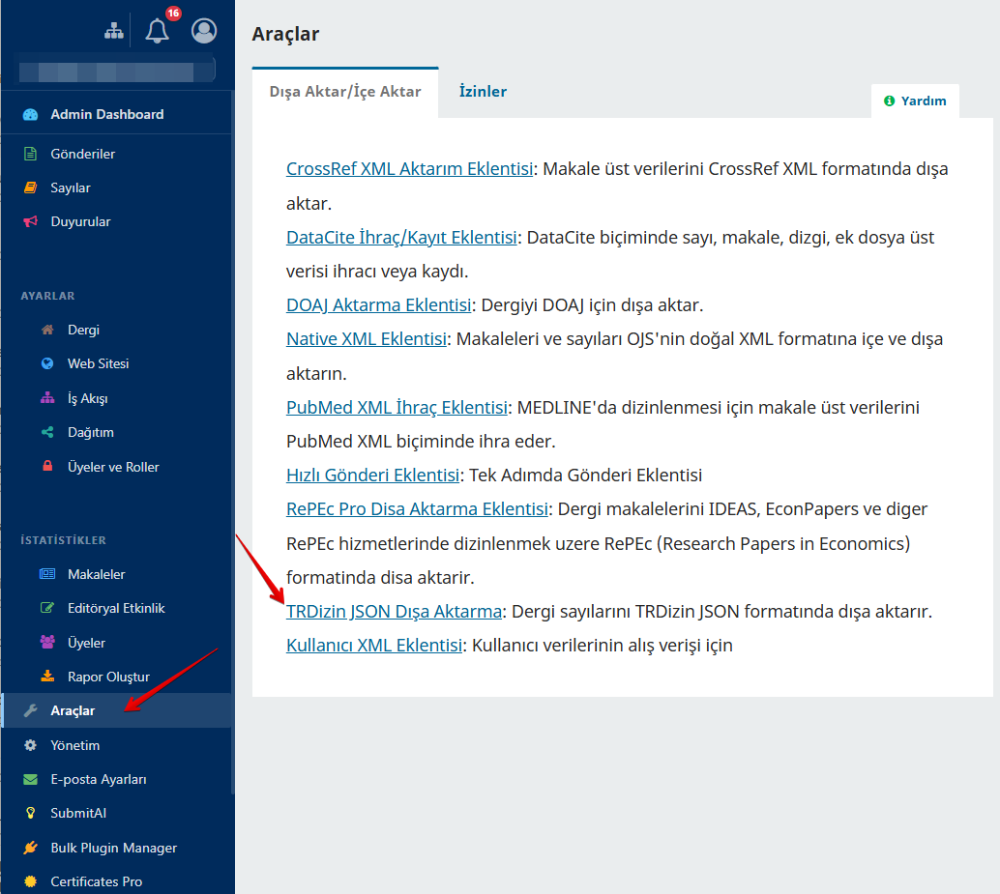
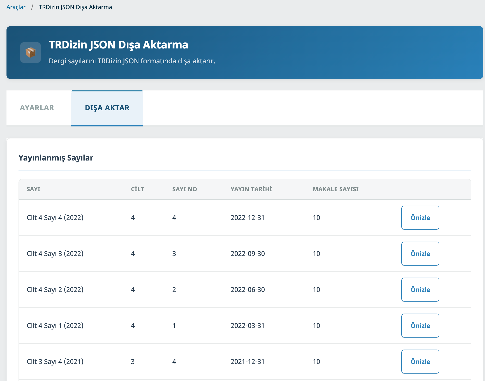
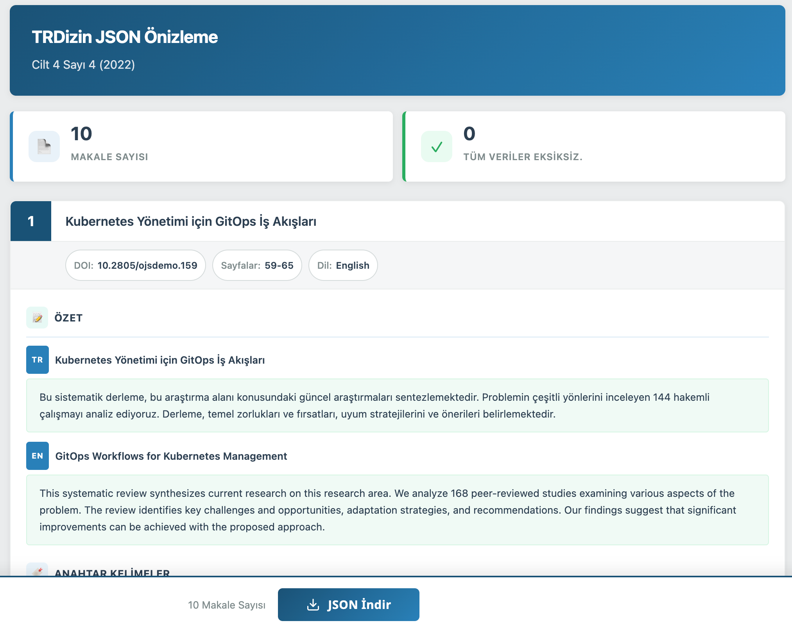

# OJS için TRDizin JSON Dışa Aktarma Eklentisi

Dergi sayılarını doğrudan Open Journal Systems (OJS) üzerinden TRDizin uyumlu JSON formatında dışa aktarın.

## Açıklama

TRDizin JSON Dışa Aktarma Eklentisi, Türkiye'nin ulusal atıf dizini [TRDizin](https://trdizin.gov.tr)'e indeksli akademik dergiler için geliştirilmiş kapsamlı bir dışa aktarma aracıdır. TRDizin'e makale meta verisi göndermek; yayın türü, çok dilli özetler, yazar ORCID bilgileri, kurum bağlantıları, kaynakçalar, konu sınıflandırmaları ve daha birçok alanı içeren özel bir JSON formatı gerektirir. Bu verileri elle hazırlamak, özellikle her sayıda onlarca makale yayımlayan dergiler için son derece zahmetli ve hataya açık bir süreçtir. Bu eklenti, makale meta verilerini doğrudan OJS veritabanından okuyarak TRDizin portalına yüklemeye hazır, tam uyumlu JSON dosyaları oluşturur ve tüm iş akışını otomatikleştirir.

Eklenti, dışa aktarma öncesinde eksiksiz bir önizleme ve doğrulama iş akışı sunar. Dergi yöneticileri, sezgisel bir kart tabanlı arayüzde tüm makale meta verilerini inceleyebilir. Her makale; başlığı, DOI'si, sayfa numaraları, dili, tüm mevcut dillerdeki özetleri, anahtar kelimeleri, yazar bilgileri (ORCID ve kurum bağlantıları dahil), kaynakçaları ve PDF indirme bağlantısı ile birlikte görüntülenir. Önizleme sayfası, eksik veya tamamlanmamış verileri net uyarı mesajlarıyla vurgulayarak editörlerin TRDizin'e göndermeden önce sorunları tespit edip düzeltmesine olanak tanır.

Eklentinin öne çıkan güçlü yanlarından biri esnek yapılandırma sistemidir. Dergi bölümleri, ayarlar panelinden TRDizin yayın türleriyle eşleştirilebilir (örneğin "Makaleler" bölümünü "Araştırma Makalesi" veya "Editoryaller" bölümünü "Editöryal" olarak eşleme). Bu eşlemeler dışa aktarma sırasında otomatik olarak uygulanır, ancak önizleme sayfasında makale bazında değiştirilebilir. Benzer şekilde, varsayılan konu alanları tüm dergi için yapılandırılabilir ve TRDizin tarafından tanınan 207 konu sınıflandırmasını içeren kapsamlı listeden her makale için ayrı ayrı ayarlanabilir.

Dışa aktarılan JSON, TRDizin'in gerektirdiği tüm alanları içerir: çok dilli başlıklar, özetler ve anahtar kelimeler içeren `publicationAbstractContents`, ORCID ve kurum verileri içeren `publicationAuthorRelations`, `publicationReferences`, `publicationSubjects`, `publicationLanguage`, `publicationNumber` (DOI), sayfa numaraları ve PDF dosya URL'si. Eklenti, TRDizin tarafından tanınan 12 dili ve 15 yayın türünü destekler. İleri düzey kullanıcılar için toplu işlem ve otomatik iş akışlarına yönelik bir komut satırı arayüzü de mevcuttur.

## Uyumluluk

| OJS Sürümü | Eklenti Sürümü | Durum |
|------------|---------------|-------|
| 3.3.x      | 1.0.0         | Destekleniyor |

## Özellikler

- **TRDizin uyumlu JSON dışa aktarma** — gerekli tüm meta veri alanlarıyla
- **Etkileşimli önizleme sayfası** — eksiksiz meta veriler gösteren makale kartları
- **Doğrulama uyarıları** — eksik ORCID, kurum bilgisi, DOI, PDF, kaynakça ve özetler için
- **Bölüm-yayın türü eşlemesi** — ayarlarda bir kez yapılandırılır, makale bazında değiştirilebilir
- **207 TRDizin konu alanı** — dergi genelinde varsayılan, makale bazında seçilebilir
- **Çok dilli destek** — özetler ve anahtar kelimeler için (Türkçe, İngilizce ve 10 ek dil)
- **15 yayın türü** — TRDizin tarafından tanınan tüm kategorileri kapsar
- **Otomatik PDF galley URL tespiti** — OJS galley dosyalarından
- **Kaynakça çıkarımı** — OJS atıf veritabanından
- **Komut satırı arayüzü (CLI)** — otomatik ve toplu dışa aktarma iş akışları için
- **İki dilli arayüz** — tam Türkçe ve İngilizce yerelleştirme
- **CSRF koruması, girdi doğrulama ve XSS önleme** yerleşik

## Kurulum

### Yükleyerek Kurulum (Önerilen)

1. [Releases](../../releases) sayfasından son sürümü indirin
2. OJS'ye Site Yöneticisi olarak giriş yapın
3. **Ayarlar > Web Sitesi > Eklentiler > Yeni Eklenti Yükle** yolunu izleyin
4. `.tar.gz` dosyasını yükleyin
5. Eklentiyi **İçeri/Dışı Aktarma** eklentileri altında etkinleştirin

### Komut Satırı ile Kurulum

```bash
cd /ojs/dizin/yolu
cp -r trdizin plugins/importexport/
php tools/upgrade.php upgrade
```

## Yapılandırma

1. **Araçlar > İçeri/Dışı Aktarma > TRDizin JSON Dışa Aktarma** yoluna gidin
2. **Ayarlar** sekmesini açın:
   - **Bölüm Eşlemesi:** Her dergi bölümünü ilgili TRDizin yayın türüyle eşleştirin (Araştırma Makalesi, Derleme, Olgu Sunumu, Editöryal vb.)
   - **Varsayılan Konu Alanları:** Derginiz için varsayılan TRDizin konu sınıflandırmalarını seçin (çoklu seçim yapılabilir)
3. **Kaydet** butonuna tıklayın

Bu ayarlar, sayıları önizlerken ve dışa aktarırken otomatik olarak uygulanır. Yayın türünü ve konu alanlarını önizleme sayfasında makale bazında değiştirebilirsiniz.

## Kullanım

### Web Arayüzü

1. **Araçlar > İçeri/Dışı Aktarma > TRDizin JSON Dışa Aktarma** yoluna gidin
2. **Dışa Aktar** sekmesine geçerek yayınlanmış sayıları görün
3. Dışa aktarmak istediğiniz sayı için **Önizle** butonuna tıklayın
4. Doğrulama uyarıları ile makale kartlarını inceleyin
5. Gerekirse makale bazında yayın türünü ve konu alanlarını ayarlayın
6. **JSON İndir** butonuna tıklayarak dışa aktarın

### Komut Satırı Arayüzü (CLI)

```bash
php tools/importExport.php TRDizinExportPlugin export cikti.json dergi_yolu sayiId
```

**Örnek:**
```bash
php tools/importExport.php TRDizinExportPlugin export trdizin_cilt4_sayi3.json dergim 30
```

## Ekran Görüntüleri

### Eklentiye Erişim
OJS yönetim panelinde **Araçlar > İçeri/Dışı Aktarma** bölümünden TRDizin JSON Dışa Aktarma eklentisine ulaşabilirsiniz.



### Dışa Aktar Sekmesi - Yayınlanmış Sayılar
Dışa Aktar sekmesi tüm yayınlanmış sayıları cilt, sayı numarası, yayın tarihi ve makale sayısıyla birlikte listeler.



### Önizleme Sayfası - Makale Kartları
Önizleme sayfası her makaleyi, eksiksiz meta veriler, doğrulama uyarıları ve düzenlenebilir alanlar içeren etkileşimli bir kart olarak gösterir.



## Lisans

Bu eklenti [GNU Genel Kamu Lisansı v3.0](LICENSE) altında lisanslanmıştır.

## Destek

- Hata Bildirimleri ve Özellik İstekleri: [GitHub Issues](../../issues)
- E-posta: info@ojs-services.com
- Web Sitesi: [ojs-services.com](https://ojs-services.com)

## Geliştirici

**[OJS Services](https://github.com/ojs-services)**
