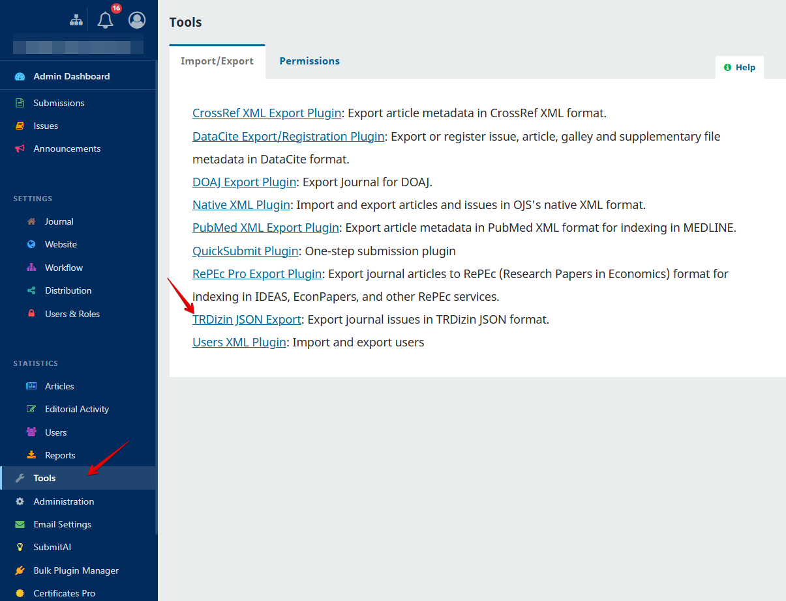
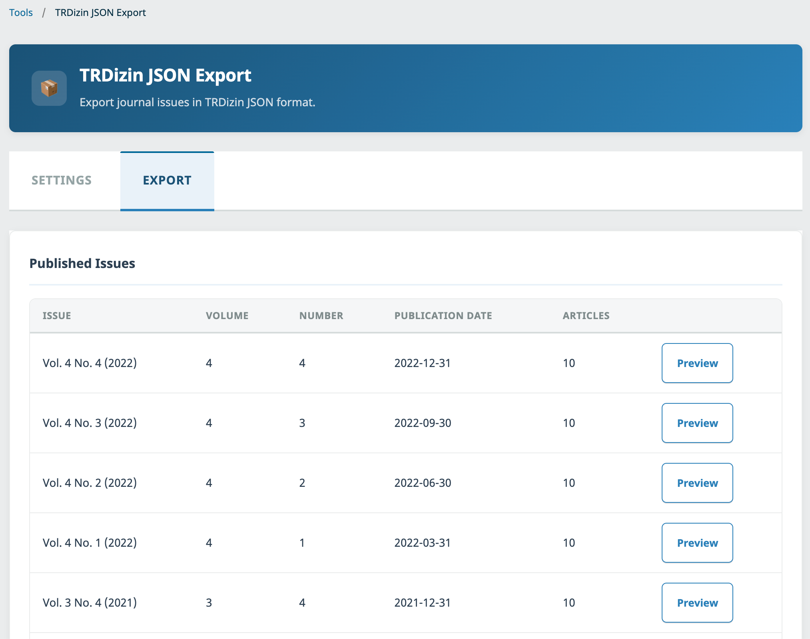
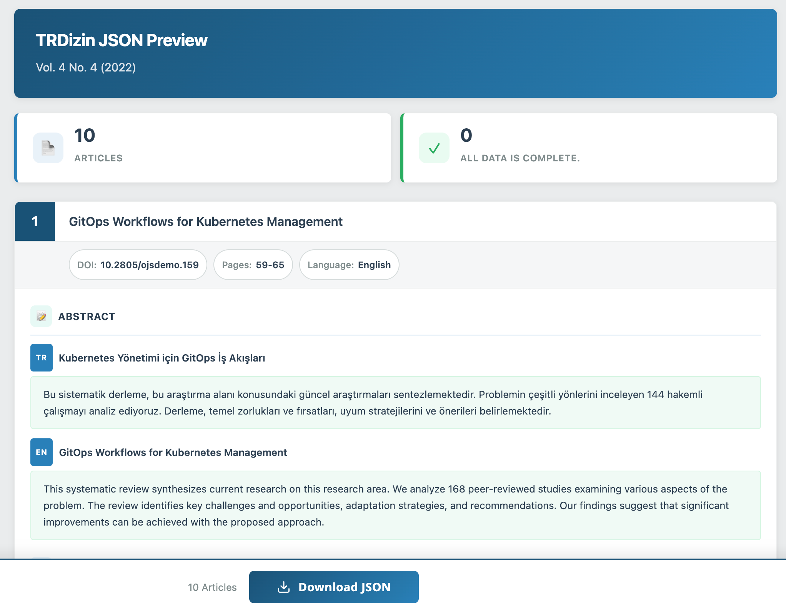

# TRDizin JSON Export Plugin for OJS

Export journal issues in TRDizin-compliant JSON format directly from Open Journal Systems (OJS).

## Description

TRDizin JSON Export Plugin is a comprehensive export tool developed for academic journals indexed in Turkey's national citation index, [TRDizin](https://trdizin.gov.tr). Submitting article metadata to TRDizin requires a specific JSON format that includes publication types, multi-language abstracts, author ORCID identifiers, institutional affiliations, references, subject classifications, and more. Preparing this data manually is a tedious and error-prone process, especially for journals publishing dozens of articles per issue. This plugin automates the entire workflow by reading article metadata directly from the OJS database and generating fully compliant JSON files ready for upload to the TRDizin portal.

The plugin provides a complete preview and validation workflow before export. Journal managers can review all article metadata on an intuitive card-based interface, where each article is displayed with its title, DOI, page numbers, language, abstracts in all available locales, keywords, author details (including ORCID and institutional affiliations), references, and PDF download URL. The preview page highlights missing or incomplete data with clear warning messages, allowing editors to identify and address issues before submitting to TRDizin.

One of the key strengths of the plugin is its flexible configuration system. Journal sections can be mapped to TRDizin publication types (e.g., mapping "Articles" to "Research Article" or "Editorials" to "Editorial") through the settings panel. These mappings are applied automatically during export but can be overridden on a per-article basis in the preview page. Similarly, default subject areas can be configured for the entire journal and adjusted individually for each article from a comprehensive list of 207 TRDizin-recognized subject classifications.

The exported JSON contains all fields required by TRDizin, including `publicationType`, `publicationAbstractContents` with multi-locale titles, abstracts, and keywords, `publicationAuthorRelations` with ORCID and institutional data, `publicationReferences`, `publicationSubjects`, `publicationLanguage`, `publicationNumber` (DOI), page numbers, and PDF file URL. The plugin supports 12 languages recognized by TRDizin and 15 publication types. For advanced users, a command-line interface is also available for batch processing and automated workflows.

## Compatibility

| OJS Version | Plugin Version | Status |
|-------------|---------------|--------|
| 3.3.x       | 1.0.0         | Supported |

## Features

- **TRDizin-compliant JSON export** with all required metadata fields
- **Interactive preview page** with article cards showing complete metadata
- **Validation warnings** for missing ORCID, affiliations, DOI, PDF, references, and abstracts
- **Section-to-publication type mapping** configured once in settings, overridable per article
- **207 TRDizin subject areas** selectable per article with journal-wide defaults
- **Multi-language support** for abstracts and keywords (Turkish, English, and 10 more languages)
- **15 publication types** covering all TRDizin-recognized categories
- **Automatic PDF galley URL detection** from OJS galley files
- **Reference extraction** from OJS citation database
- **Command-line interface (CLI)** for automated and batch export workflows
- **Bilingual interface** with full Turkish and English localization
- **CSRF protection, input validation, and XSS prevention** built in

## Installation

### Via Upload (Recommended)

1. Download the latest release from the [Releases](../../releases) page
2. Log in as Site Administrator in OJS
3. Navigate to **Settings > Website > Plugins > Upload A New Plugin**
4. Upload the `.tar.gz` file
5. Enable the plugin under **Import/Export** plugins

### Via Command Line

```bash
cd /path/to/ojs
cp -r trdizin plugins/importexport/
php tools/upgrade.php upgrade
```

## Configuration

1. Navigate to **Tools > Import/Export > TRDizin JSON Export**
2. Open the **Settings** tab:
   - **Section Mapping:** Map each journal section to the corresponding TRDizin publication type (Research Article, Review, Case Report, Editorial, etc.)
   - **Default Subject Areas:** Select the default TRDizin subject classifications for your journal (multiple selections allowed)
3. Click **Save**

These settings are applied automatically when previewing and exporting issues. You can override the publication type and subject areas on a per-article basis in the preview page.

## Usage

### Web Interface

1. Go to **Tools > Import/Export > TRDizin JSON Export**
2. Switch to the **Export** tab to see published issues
3. Click **Preview** for the issue you want to export
4. Review article cards with validation warnings
5. Adjust article type and subject areas per article if needed
6. Click **Download JSON** to export

### Command Line Interface

```bash
php tools/importExport.php TRDizinExportPlugin export output.json journal_path issueId
```

**Example:**
```bash
php tools/importExport.php TRDizinExportPlugin export trdizin_vol4_no3.json myjournal 30
```

## Screenshots

### Accessing the Plugin
Navigate to **Tools > Import/Export** in the OJS dashboard to find TRDizin JSON Export.



### Export Tab - Published Issues
The Export tab lists all published issues with volume, number, publication date, and article count.



### Preview Page - Article Cards
The preview page displays each article as an interactive card with full metadata, validation warnings, and editable fields.



## License

This plugin is licensed under the [GNU General Public License v3.0](LICENSE).

## Support

- Bug Reports & Feature Requests: [GitHub Issues](../../issues)
- Email: info@ojs-services.com
- Website: [ojs-services.com](https://ojs-services.com)

## Author

**[OJS Services](https://github.com/ojs-services)**
